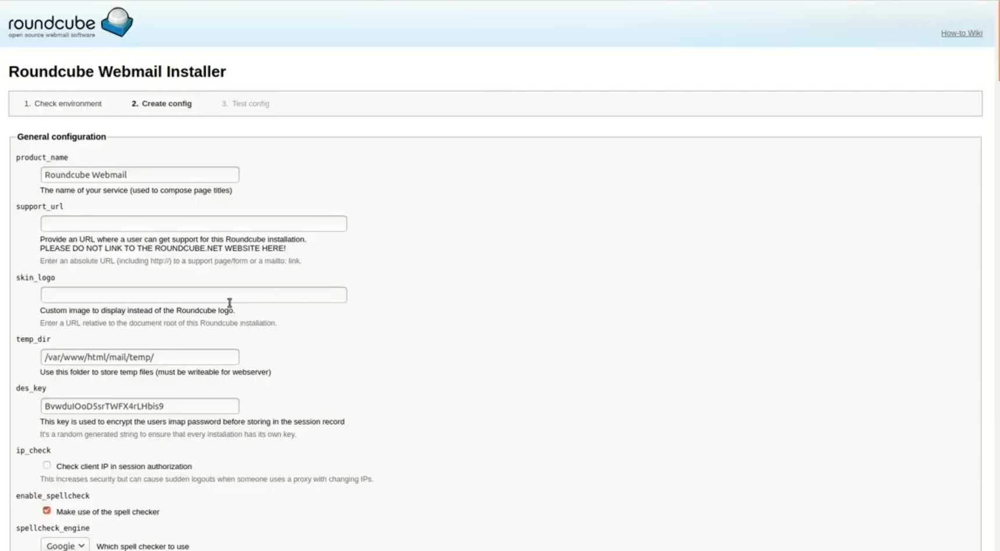
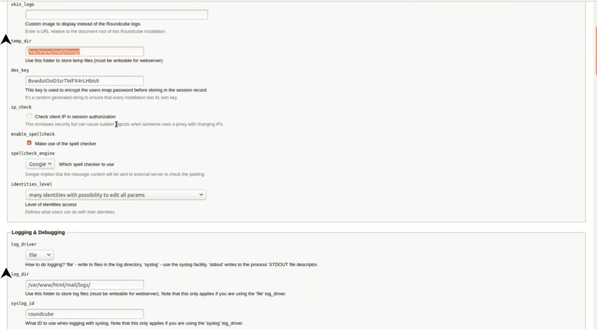
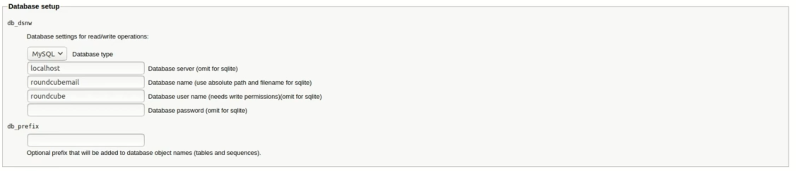
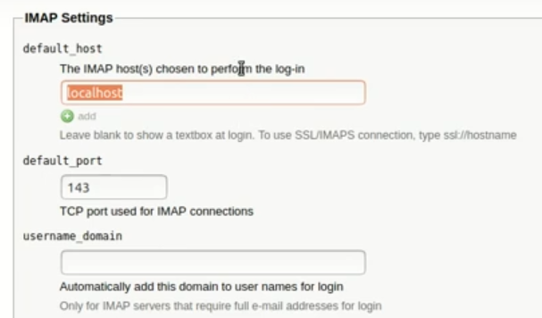
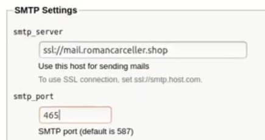
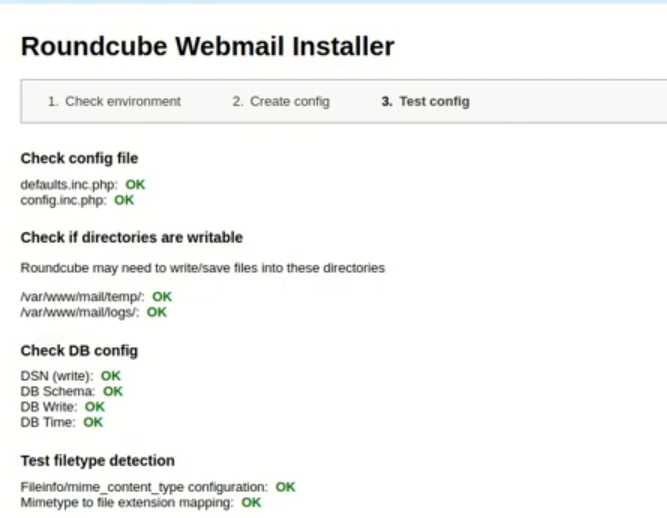

# Implementación de WebMail para linux - Ubuntu v.20
En la siguiente guía se llevará acabo la instalación de un servicio webmail para el sistema de correos anteriormente creada, el sistema webmail que se utilizará será Roundcube.

## Paso 1: Requisitos previos 
Antes de realizar la instalación del webmail `Roundcube` debemos cerciorar si cumplimos con todos los requisitos solicitados por el sistema, para revisar estos requisitos nos dirigmos a al siguiente link `https://github.com/roundcube/roundcubemail/wiki/Install-Requirements` 

## Paso 2: Instalación de roundcube
Luego de instalar todo lo solicitado por el `Roundcube` vamos a instalar el roundcube por medio de la consola con el siguiente 
comando
```bash
apt-get install roundcube
```
luego de instalar los paquetes saldrá una pantalla emergente donde solicitará un contraseña para elaborar un usuario en la base de datos
y tener los permisos sobre ella. al ingresar la contraseña y continuar ya esperaremos que se ejecuten los comandos de la base de datos y se terminen de instalar todos los paquetes.

## Paso 3: Configuración de roundcube
Una vez instalado los paquetes ya podremos acceder a nuestra pagina web para configurar los protocolos utilizados para la conmunicación, el usuario y contraseña de la base de datos y la información basica sobre nuestro servidor de correo como lo es el nombre de dominio

Antes de continuar vamos a crear 2 carpetas en /etc/www/mail/ con el nombre `log` y `temp` y le daremos los permisos al usuarios www-data para obtener todos los permisos sobre ella, de lo contrario lanzará un error al final por no lograr reconocer las carpetas y poder realizar escrituras o lecturas sobre la misma.
```bash
sudo chown -R www-data:www-data /var/www/mail
sudo chmod -R 775 /var/www/mail
```

luego de realizar esto ingresamos a MySQL para crear un usuario y brindarle todos los privilegios sobre la base de datos, este usuario lo necesitará el roundcube para administar las tablas creadas por el instalador.
```MySQL
USE *Nombre de la base de datos* (Este nombre lo podemos ver ejecutando el comando *SHOW DATABASES;*)
CREATE USER 'NOMBRE DE USUARIO' IDENTIFIED BY 'CONTRASEÑA';
GRANT ALL PRIVILEGES ON *.* TO 'NOMBRE DE USUARIO';
```

Luego de crear este usuario estamos listos para ingresar a la pagina de configuración del roundcube, en nuestro buscador ingresaremos a la pagina `http://*nombre del dominio*/mail/installer`.

Esta es la pagina principal que se desplegará en nuestra pantalla


debemos realizar unos cuantos cambios que seguidamente se especificaran por medio de imagenes

Cambiamos la ruta de la carpeta temp y log por la que creamos anteriormente y ya tienen los permisos.

Luego tenemos que cambiar la configuración de la base de datos en esta sección

Cambiamos el Database name por el que anteriormente usamos en el comando USE
Cambiamos el Database user name y database password por el que anteriormente creamos para el usuario.

Por ultimo cambiamos la configuración deL IMAP Y SMTP para especificar el nombre de dominio y el puerto sobre el cual va trabajar

Acá debemos ssl://*nombre de nuestro dominio*
Tambien el puerto sobre el que trabaja, en nuestro caso por tener SSL/TLS este puerto será 993 para IMAP o 995 para POP
y el username_domain será nuestro nombre de dominio.


para el SMTP colocaremos lo mismo del paso anterior y en este caso trabajará sobre el puerto 465 que es el SMTP para SSL/TLS.

una vez terminada todos estos paso iremos hasta el fondo y precionamos el boton de crear configuración.

si todo fue bien configurado y tenemos todos los check podemos dirigirnos a la terminal y entrar al archivo /etc/html/mail/conf.php.init y buscamos $config['enable_installer'] = true; y la cambiamos a false para deshabilitar que puedan realizar cambios a la configuración desde la web.

